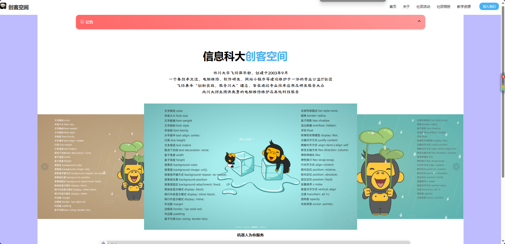
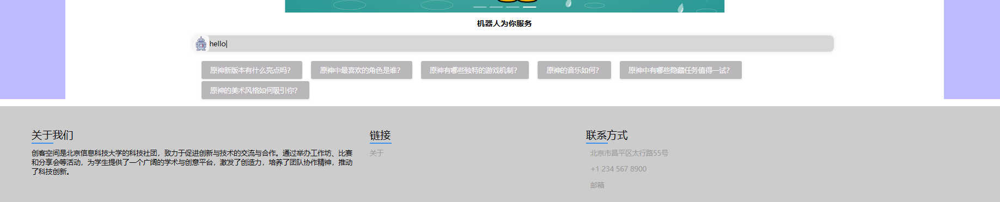
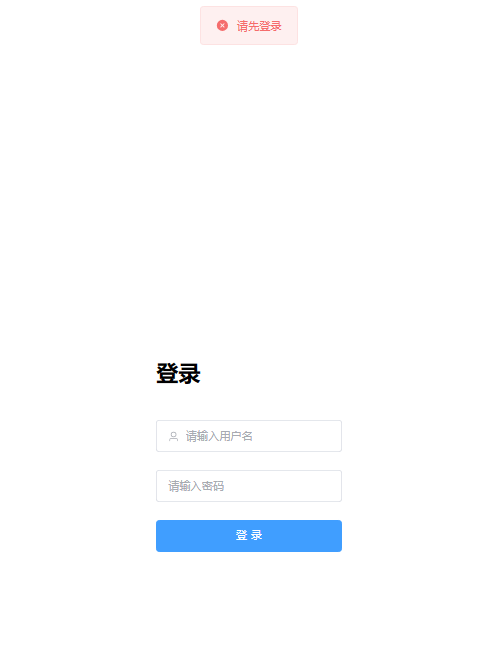
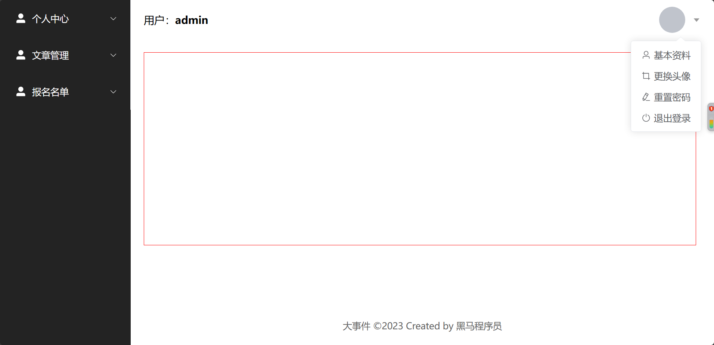
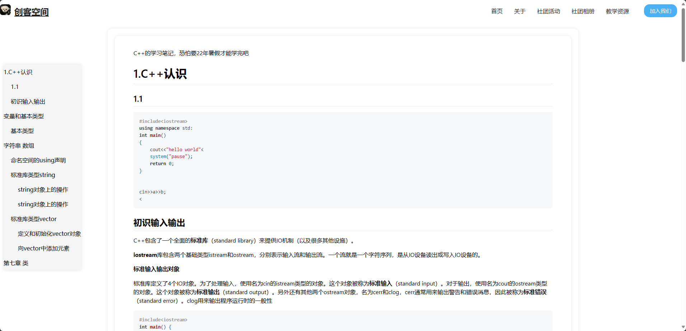

## 23年12月9日

### 项目初建

因为这是第一次实际去应用自己所学的知识来为社团去构建网页。

### 项目构思

 清晰简洁，以活动为主线。首页突出展示社团最新和即将举办的活动，以吸引访客。

### 前台

**技术选型：** 我们决定采用Vue框架构建前台，以其灵活性和高效性而著称。

**设计思路：** 清晰简洁，以活动为核心。首页突出展示社团最新和即将举办的活动，吸引访客的眼球。

**UI库选择：** 我们考虑使用一些UI库，比如Element UI或者Ant Design Vue，以便快速构建出美观且富有交互性的页面。

**功能：**

- **活动展示：** 明确呈现社团最新的活动，包括详细的活动信息，吸引更多人参与。
- **图片集锦：** 创建一个精美的照片集，展示社团过去活动的瞬间，让人更好地了解我们的精神风貌。
- **参与方式：** 提供参与社团的方式，如加入我们、报名参加活动等。

### 后端

**技术选型：** 我们选择使用Spring Boot搭建后台，以其简洁高效的特点。

**核心功能：**

- **活动管理：** 后台方便地发布、编辑、删除社团活动，确保信息实时更新。
- **图片上传：** 管理员可以方便地上传和管理活动照片，让网站更具吸引力。

**数据库：** 我们计划采用MySQL作为后台数据库，以存储活动信息、用户数据等。

## 借鉴的网页

[首页 - 四川大学飞扬俱乐部 (fyscu.com)](https://www.fyscu.com/)

## 1月更新
有段时间没写更新日志了 大概我都干了什么呢
第一点是完成后端和后台的编写,传统的后台和前台是分开写着的,但我想了想看也没有这个必要,毕竟网页不大,就这几天网页就这样吧.
 
目前实现了用户的增删改查;文章的增删改查;通知表的创建;
 
前端实现如图所示

## 1月23日更新
终于实现了文章的显示,以及侧边显示目录,早上起来再改改api连接之类的.

