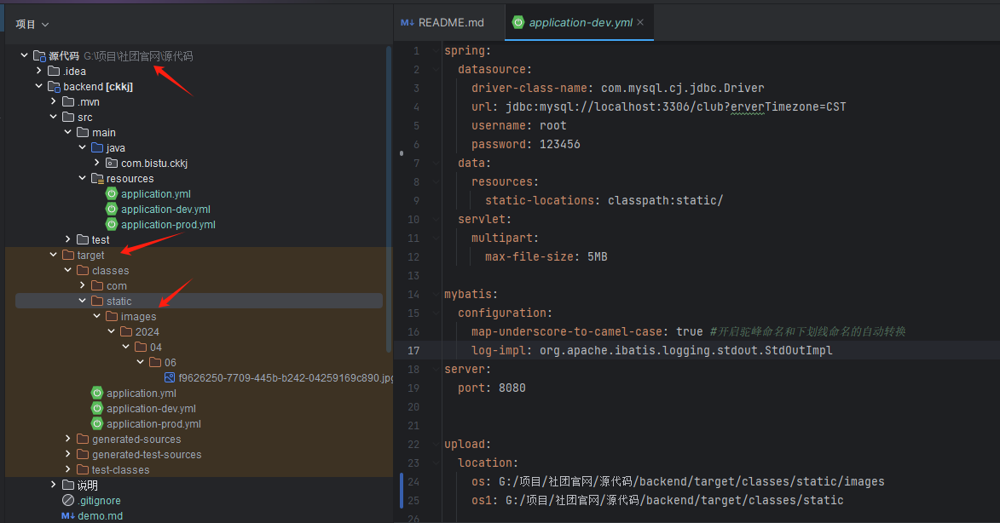
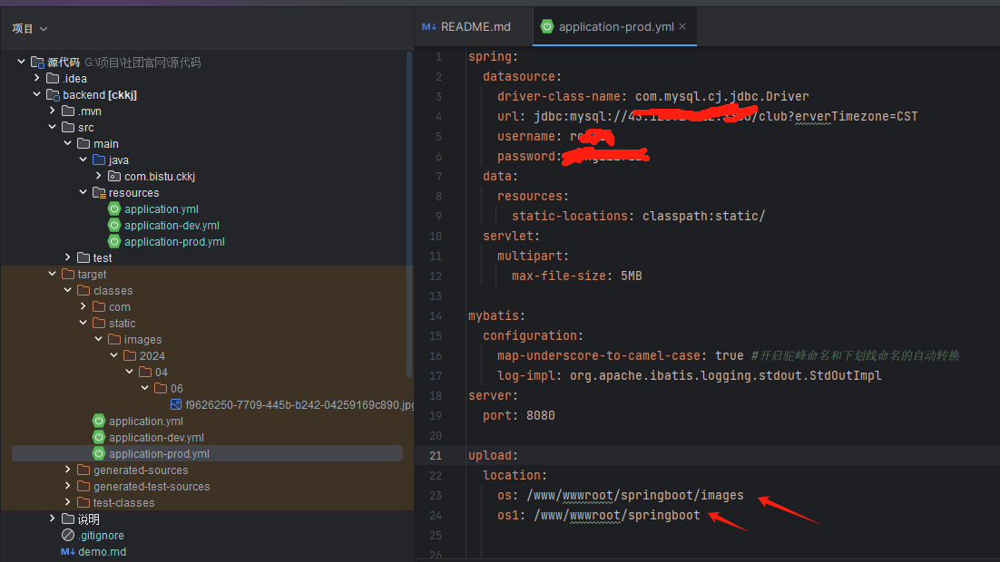
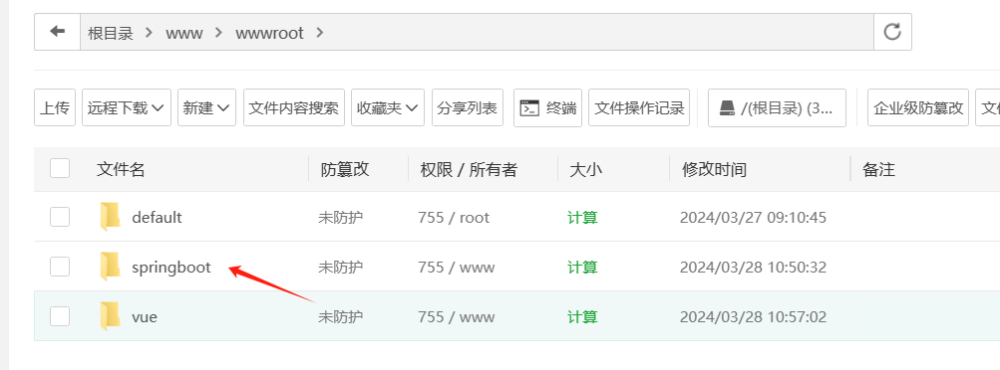
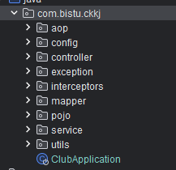
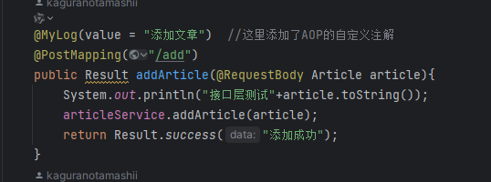

# 后端代码说明

## 项目目录说明

```
├─.mvn
│  └─wrapper# Maven wrapper 相关配置
├─src
│  ├─main
│  │  ├─java
│  │  │  └─com
│  │  │      ├─bistu
│  │  │      │  └─ckkj
│  │  │      │      ├─aop         # 切面编程相关类
│  │  │      │      ├─config      # 配置类
│  │  │      │      ├─controller  # 控制器类
│  │  │      │      ├─exception   # 异常处理类
│  │  │      │      ├─interceptors # 拦截器类
│  │  │      │      ├─mapper      # MyBatis Mapper 接口
│  │  │      │      ├─pojo        # 实体类
│  │  │      │      ├─service
│  │  │      │      │  └─impl     # 服务接口实现类
│  │  │      │      └─utils       # 工具类
│  │  │      └─example            # 示例代码目录
│  │  └─resources
│  │      └─com
│  │          ├─bistu
│  │          │  └─ckkj
│  │          │      └─mapper    # MyBatis Mapper XML 文件
│  │          └─example       # 示例资源文件
└─target    # 测试类编译后的目录
    ├─classes
└─target 
│  
└─sql.sql #数据库文件
│  
└─pom.xml #maven配置文件
```

这个也便是后端最基本的骨架，接下来我将要对此进行详细说明

### pom.xml

Maven 作为 Java 项目管理工具，它不仅可以用作包管理，还有许多的插件，可以支持整个项目的开发、打包、测试及部署等一系列行为。传统工程我们直按把jar包放置在项目中， Maven工程真正的jar包放置在仓库中，项目中只用放置jar包的坐标。

### sql.sql

数据库文件

### src核心代码

分为main和test两个文件夹，主要讨论main的代码

main文件夹里面包括java和resources


#### resources文件夹

资源里面主要是springboot的配置项，针对dev和prod两个开发环境的配置。

dev是本地配置，prod是服务器配置

其中这里需要修改的有数据库以及upload的目录





upload目录的话如果是本地部署建议改到根据项目目录下的位置

比如本电脑目录是在 项目/源代码/backend  如果没有target后面那几个目录可以自己创建，当然不创建上传图片也会自动创建的。

如果是线上部署，这个就别动了，利用宝塔将项目部署到 根目录/www/wwwroot 这里不创建images也可以打包后运行项目上传图片会自动创建




#### java文件夹

这里的代码都是核心后端代码，建议用idea打开启动。



clubApplication文件是项目的启动类


#### 各级框架

Pojo层，Mapper层，Service层，Controller层

这里的话推荐阅读几篇文章(dao层就是mapper层)


[SpringBoot框架中的DAO层、Entity层、Service层、Controller层 - 简书 (jianshu.com)](https://www.jianshu.com/p/18c4418e9b99)

[Pojo层，Dao层，Mapper层，Service层，Controller层-CSDN博客](https://blog.csdn.net/qq_46423017/article/details/127582757)


#### aop文件夹

这里有两个文件

Mylog.java是自定义注解，

在执行任何一条接口时（在controller层），都会调用aop切口，根据注解来生成log日志，保存到数据库里




SysLogAspectle.java是实现自定义切口类


#### config文件夹


HttpConverterConfig.java
实现了Spring MVC的WebMvcConfigurer接口，用于配置静态资源的处理。


WebConfig.java
实现了Spring MVC的WebMvcConfigurer接口，用于配置Spring MVC的拦截器。


#### exception文件夹

GlobalExceptionHandler.java
该Java函数是一个全局异常处理器，使用了Spring Boot提供的@RestControllerAdvice注解来定义一个控制器顾问，它针对所有控制器抛出的异常进行处理。


#### interceptors文件夹

LoginInterceptor.java
该函数是一个登录拦截器，用于在请求处理之前进行令牌验证。它从请求头中获取令牌，然后通过调用tokenService验证令牌的有效性。如果令牌有效，则将业务数据存储到ThreadLocal中并放行请求；如果令牌无效，则返回401状态码拒绝请求。在请求处理完成后，该拦截器还会清空ThreadLocal中的数据。


#### utils文件夹

工具类


