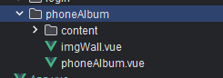
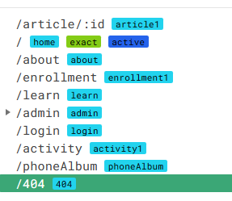
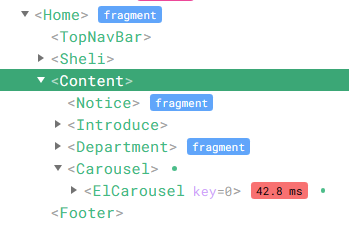
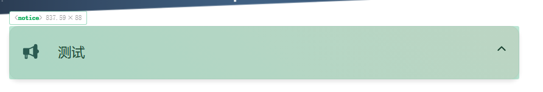
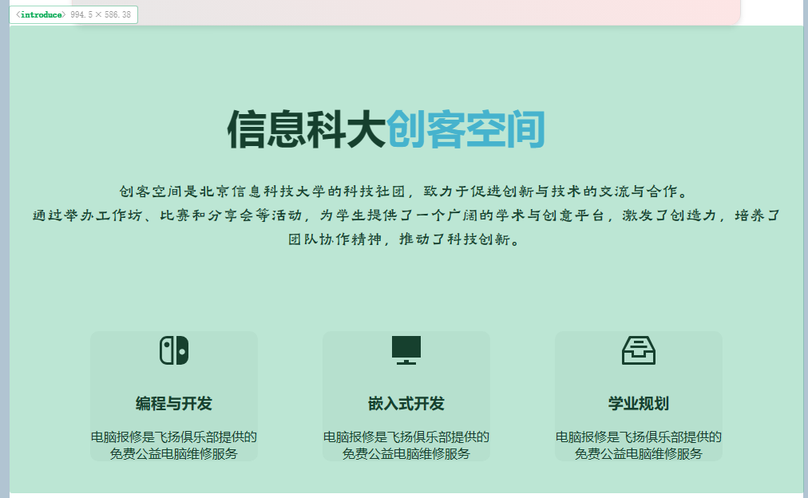
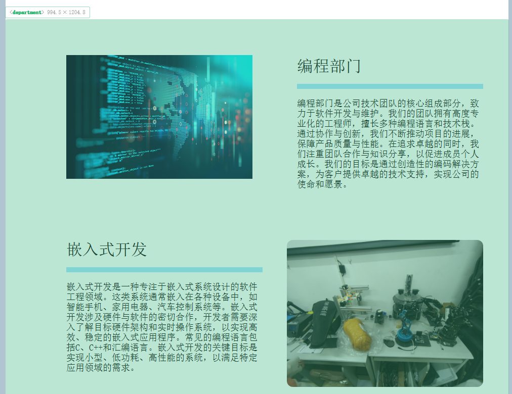
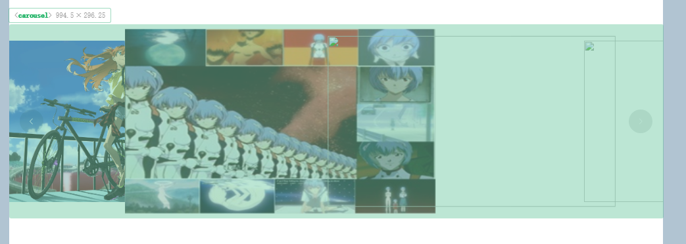
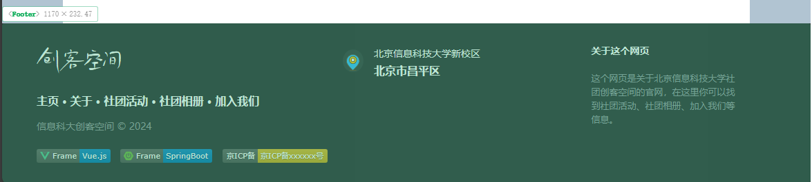
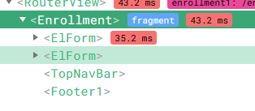

# 前端文档说明

## 项目目录说明

```
├─public 				// 公共资源目录
├─src    				// 源代码目录
│  ├─api 				// API 请求相关代码目录
│  ├─assets  			// 静态资源目录
│  │  ├─data
│  │  ├─font
│  │  └─js
│  ├─components  		// 组件目录
│  │  ├─Content
│  │  │  └─notice
│  │  ├─Footer
│  │  └─TopNavBar
│  ├─router				// 路由相关代码目录
│  ├─stores				 // 状态管理相关代码目录
│  ├─utils				 // 工具函数目录
│  └─views				// 视图目录
│      ├─about				// 关于页面目录
│      ├─activity			// 活动页面目录
│      ├─article			// 文章页面目录
│      │  ├─404
│      │  └─comment	 		// 评论组件目录
│      ├─enrollment			// 报名页面目录
│      ├─home				// 主页目录
│      │  ├─answer
│      │  ├─carouselMain	// 主轮播组件目录
│      │  ├─department		// 部门组件目录
│      │  ├─introduce		// 介绍组件目录
│      │  └─sheli
│      ├─layout				// 后台布局
│      │      ├─enrollment
│      │      ├─notifications
│      │      ├─other
│      │      ├─phoneAlbum
│      │      └─user
│      │          ├─userAllInfo
│      │          └─userInfo
│      ├─learn				// 学习页面目录
│      ├─login				// 登录页面目录
│      └─phoneAlbum			// 手机相册页面目录
│          └─content
└─说明

```


前端我将根据网页的路由来去解构部分的组件来说明，为了更好的更容易的去搞懂我写的大概框架流程。

这里使用vue devtools工具来查看组件名称，方便了解组件在哪里显示

公共组件是top和fonter

所以主要看视图目录的代码


实际上我写的视图则是根据路由文件来分类的，彼此之间都是独立的。比如[相册(http://localhost:5173/phoneAlbum)

相册则是在这一部分里




路由文件是router里面的index.js



**首页**















**报名页**



其他的路由页面都同理，所以这里不在过多说明了，故省略。


